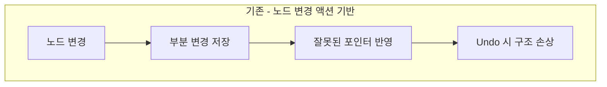
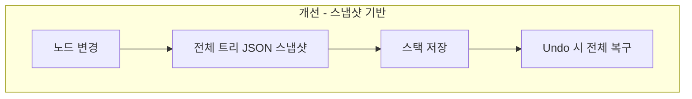
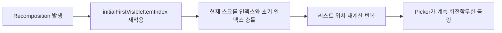

# ☁️구름한장(GureumPage)

> 전자책이나 종이책 상관없이 독서 기록을 남기고
 필사를 작성하거나 마인드맵으로 생각을 구조화 할 수 있는 독서 기록 앱

 

# 📖개요

> 구름한장은 독서 기록을 더 깊이, 더 오래 남기고 습관 형성을 도와주기 위해 개발한 앱입니다.
 전자책이 많아진 요즘 환경에 맞춘 **플로팅 윈도우 타이머**
 독서 기록을 더 오래, **마인드맵**과 **필사**로 더 깊이 남기고,
 **알림**과 **통계**로 꾸준한 습관 형성을 도와줄 수 있도록 설계한 서비스입니다.

**🗓️ 기간**: 2025.07.28 ~ 2025.09.02

**👥 인원**: Android 개발자 4명

**👨‍💻 역할**: 부팀장 / Android 개발자
- Notion 기반 협업 환경 구성 & GitHub Project로 이슈 관리
- 앱 공통 테마 및 디자인 시스템 구축
- 온보딩 화면, 마인드맵 기능, 통계 등 주요 화면 개발
- 로컬 알림 기능 구현
- 코드 리뷰 및 품질 관리

**🏆 수상**: LIKELION Android Bootcamp 최우수 프로젝트

**🔗 Team GitHub**: [https://github.com/LIKELION-Android-Bootcamp-4th/GureumPage](https://github.com/LIKELION-Android-Bootcamp-4th/FinalProject-GureumPage-HIHIHIHI)

**🔗 Play Store**: [https://play.google.com/store/apps/gureumpage](https://play.google.com/store/apps/details?id=com.hihihihi.gureumpage)

 

# 📱주요 기능 

| 섹션 | 주요 기능 |
|---|---|
| 인증 (Firebase Auth) | • 소셜 로그인: 네이버 / 카카오 / 구글 |
| 홈 | • 현재 읽는 중 책 목록과 정보 제공 • 하루 독서 목표 설정 & 도넛 차트로 달성도 확인 • 작성한 필사 문장 랜덤 노출 |
| 도서 검색 | • 키워드 검색: 제목 / 저자 / 출판사 / ISBN • 결과: 표지·제목·저자·페이지 수 등 상세 정보 표시 |
| 서재 | • 상태별 목록 관리: 읽을 책 / 읽는 중 / 읽은 책 • 항목 클릭 시 책 상세 화면으로 이동 |
| 책 상세 화면 | • 독서 진행도·독서 기간·누적 시간·하루 평균 시간 • 기록: 타이머 또는 직접 기입 • 책당 1개의 마인드맵 생성·관리  |
| 독서 타이머 | • 책 상세/위젯에서 진입, 시작·정지·재개 • 플로팅 윈도우 제공(드래그/스와이프 조절, 다른 앱 위 동작) |
| 인상 깊은 문장(필사) | • 타이머 중 또는 책 상세에서 작성 • 앱 내 전체 필사 목록에서 도서 구분 없이 열람 |
| 마인드맵 | • 책별 1개 마인드맵 생성 • 아이디어/개념/인물/사건 흐름 시각화 • 노드 추가·삭제·이동·편집 • 스냅샷 기반 undo/redo 등 |
| 통계 | • 읽은 책 장르: 도넛 차트 • 시간대/요일별 읽은 페이지: 바/라인 차트 • 주간·월간·연간 필터 |
| 마이페이지 | • 닉네임 변경 • 총 독서 통계 요약 • 라이트/다크 테마 전환 • 로그아웃, 탈퇴 |
| 온보딩 | • 닉네임 설정 • 앱 사용 목적 조사 & 앱 소개 • 테마(라이트/다크) 선택 |

 

# 🛠️기술 스택

| 카테고리 | 기술 |
| ----- | ----- |
| **언어/빌드** | Kotlin, Gradle(KTS) |
| **UI/UX** | Jetpack Compose, Glance |
| **아키텍처** | MVVM + Clean Architecture, Multi Module |
| **DI** | Hilt |
| **비동기/데이터** | Coroutine, Flow, DataStore |
| **백엔드** | Firebase Auth, Functions, Firestore, FCM |
| **API** | 책 검색 - 알라딘 API |
| **네트워크** | Retrofit2, OkHttp3, Gson |
| **이미지/애니메이션** | Coil, Lottie |
| **기타** | MPAndroidChart, kizitonwose/Calendar, android-thinkmap-treeview |

 

# 🔍기술 선택 이유

### Clean Architecture + Multi Module
- 화면 수와 기능이 많고, 2차 개발과 기능 추가를 고려해 유지보수성과 확장성이 좋은 CA 도입
- Domain 계층에서 비즈니스 로직을 관리할 수 있도록 설계
- 모듈 단위 나누어 의존성 및 빌드 시간 감소 효과

### Hilt
- CA + Multi Module 로 모듈 간의 의존성 주입이 많아져 모듈별 DI를 분리하고 필요한 객체를 안정적으로 주입
- Firebase, Retrofit, Repository 처럼 Singleton 객체가 많아 앱 전체에 쉽게 재사용
- 도서 검색 API를 변경하거나 Firebase를 Supabase로 변경이 필요할 때 DI 모듈만 수정  

### Firebase Auth, Firestore
- 백엔드 인력이 없는 팀에서 사용하기 좋음
- OAuth 로그인을 위해 Functions에서 Custom Token 발급 구조 적용
- 기록, 통계 등 Firestore의 실시간 읽기/쓰기 안정적임

### Glance 위젯
- Compose UI와 비슷한 선언형 UI로 위젯 구현 가능
- 앱 사용자의 독서 접근성 향상

### Calendar, MPAndroidChart 등 외부 라이브러리
- 직접 제작하는 데 시간이 많이드는 달력, 차트 등을 효율적으로 구현
- 커스터마이징 가능한 라이브러리만 선별해 적용

 

# 🧱아키텍처

### 시스템 구조도

- 백엔더가 없는 팀으로, 클라우드 서비스인 **`Firebase`** 를 중심으로 백엔드 구성
    - **`Auth`** 로 소셜 로그인을 사용하며 **`Functions`** 로 Custom Token을 반환하여 카카오, 네이버 로그인 지원
    - **`FireStore`** 로 데이터 저장 및 조회 기능 구현
    - 기본적으로 로컬 알림을 사용하되, 실시간 알림 필요 시를 대비해 FCM 사용
- 도서 검색을 위한 알라딘 API 사용

### CA + MVVM + Multi Module

- **`MVVM`** 으로 UI 와 비즈니스 로직을 분리
- **`Clean Architecture`** 로 계층간 의존성을 줄이고 확장성과 유지보수성을 높임
- **`Multi Module`** 을 적용해 계층 간 구분을 더 확실하게 만듦

 

# 🎯트러블슈팅

### 마인드맵 라이브러리 선택 & Undo/Redo 불안정 문제

- Android에서 사용할 수 있는 라이브러리가 적고, 선택한 라이브러리는 미완성이라 기능 제약이 많았음
- 노드 CRUD 스택 기반 Undo/Redo 기능은 참조 충돌로 구조가 망가지거나 NPE 등의 오류가 많았음
- 트리 전체를 저장하는 스냅샷 기반 Undo/Redo 기능으로 변경해 안정성을 높임

[🔗 자세히 보기](https://www.notion.so/2725686b19438051953dfe855c97800c?source=copy_link)

---

### OAuth 로그인 릴리즈 빌드 오류

- 출시 심사 과정에서 카카오, 구글 로그인이 동작하지 않는 문제 발생
- 원인은 Firebase 와 Kakao Developers 에 릴리즈 서명키 SHA-1 키 등록하지 않음
- 서명키를 각각의 방식으로 처리해 등록해 해결
  
[🔗 자세히 보기](https://www.notion.so/2725686b194380d98c84cd1ebea4a0be?source=copy_link)

---

### 시간 선택 커스텀 피커 무한 롤링 문제

- 커스텀 시간 피커가 특정 상황에서 계속 회전해 멈추지 않는 문제 발생
- LazyListState 초기 인덱스가 recomposition 마다 재계산해 적용되던 것
- 선택된 시간 상태를 따로 만들어 초기값과 현재값이 섞이지 않도록 해 해결
 
[🔗 자세히 보기](https://www.notion.so/2bf5686b194380b7b516e9c8b1b677ca?source=copy_link)

 

# 📷주요 화면 스크린샷

<table>
  <tr>
    <td align="center">
      홈 화면
    </td>
    <td align="center">
      책 상세
    </td>
    <td align="center">
      필사 추가
    </td>
  </tr>
  <tr>
    <td align="center">
      
    </td>
    <td align="center">
      
    </td>
    <td align="center">
      
    </td>
  </tr>
  <tr>
    <td align="center">
      마인드맵
    </td>
    <td align="center">
      스톱워치
    </td>
    <td align="center">
      통계
    </td>
  </tr>
  <tr>
    <td align="center">
      
    </td>
    <td align="center">
      
    </td>
    <td align="center">
      
    </td>
  </tr>
</table>

 

# 📹시연 영상

  

 

# 🚀향후 개선 계획

- 테스트 코드 작성 및 UI 테스트 도입
- Firebase Analytics, Performance 추가
- 마인드맵 AI 도입 - 자동 마인드맵 생성 기능
- 위젯 기능 확장
- 성능 측정 후 개선

 
