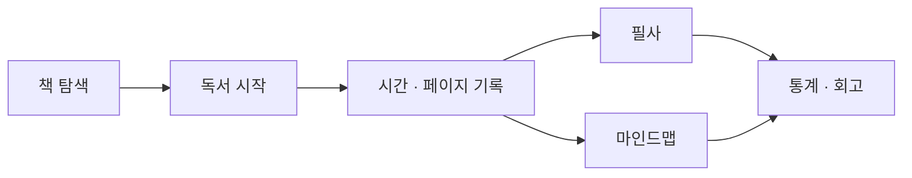
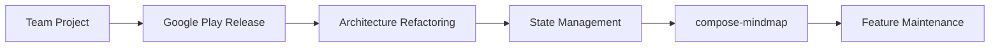
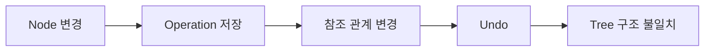
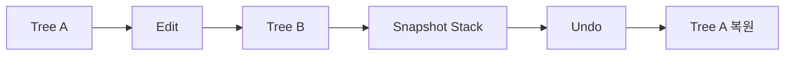
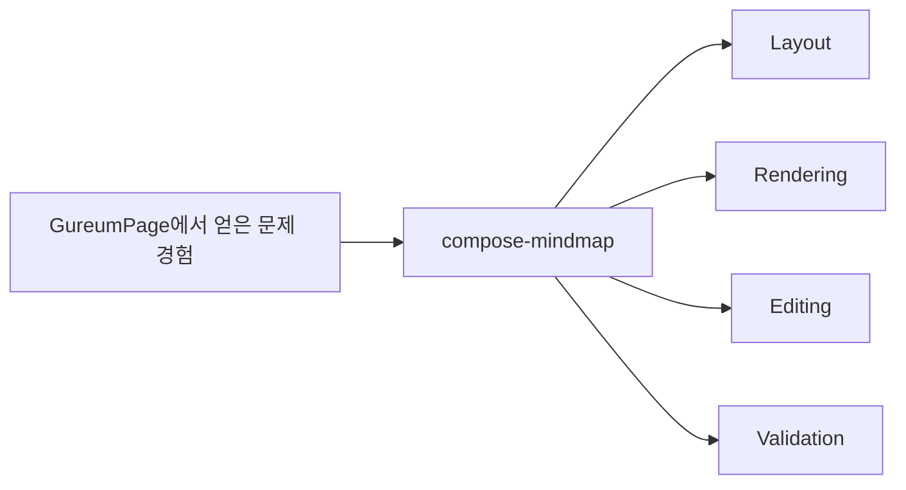
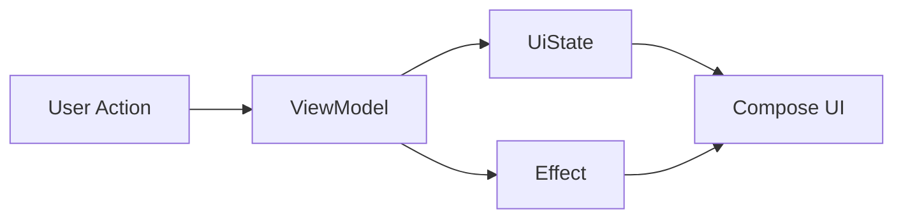
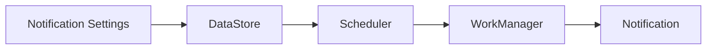

<div align="center">


# ☁️ 구름한장 GureumPage

**한 장씩 넘기며 기록하는 나의 독서 노트**

전자책이나 종이책에 관계없이 독서 기록을 남기고,<br/>
필사와 마인드맵으로 읽은 내용을 오래 기억할 수 있도록 돕는 Android 앱입니다.


[](https://play.google.com/store/apps/details?id=com.hihihihi.gureumpage)
[](https://github.com/LIKELION-Android-Bootcamp-4th/FinalProject-GureumPage-HIHIHIHI)

</div>

---

## Why GureumPage?

책을 다 읽고 나면 내용은 생각보다 빠르게 흐려집니다.

구름한장은 단순히 읽은 책을 저장하는 것보다 다음 경험을 하나의 앱 안에서 이어가는 데 집중했습니다.

- 읽고 있는 책과 독서 시간을 기록하고
- 마음에 남은 문장을 필사하고
- 생각과 관계를 마인드맵으로 정리하고
- 통계와 알림을 통해 독서 습관을 이어갑니다.


```mermaid
flowchart LR
    A["책 탐색"]
    B["독서 시작"]
    C["시간 · 페이지 기록"]
    D["필사"]
    E["마인드맵"]
    F["통계 · 회고"]

    A --> B --> C
    C --> D
    C --> E
    D --> F
    E --> F
```

---

## Product Experience

<table>
  <tr>
    <td align="center">홈</td>
    <td align="center">책 상세</td>
    <td align="center">필사</td>
  </tr>
  <tr>
    <td align="center">
      
    </td>
    <td align="center">
      
    </td>
    <td align="center">
      
    </td>
  </tr>
  <tr>
    <td align="center">마인드맵</td>
    <td align="center">독서 타이머</td>
    <td align="center">통계</td>
  </tr>
  <tr>
    <td align="center">
      
    </td>
    <td align="center">
      
    </td>
    <td align="center">
      
    </td>
  </tr>
</table>

| Read | Record | Organize |
| --- | --- | --- |
| 읽고 있는 책과 진행도를 관리합니다. | 타이머와 필사로 독서 경험을 기록합니다. | 마인드맵과 통계로 읽은 내용을 다시 정리합니다. |
| 서재 · 도서 검색 · 책 상세 | 타이머 · 플로팅 윈도우 · 필사 | Mind Map · Statistics · Reminder |

---

## Project

| | |
| --- | --- |
| **개발 기간** | 2025.07.28 ~ 2025.09.02 |
| **Android Team** | 4명 |
| **Role** | 부팀장 · Android Developer |
| **Result** | Google Play 출시 |
| **Award** | LIKELION Android Bootcamp 최우수 프로젝트 |

### My Contribution

- Notion 기반 협업 환경과 Git convention / branch strategy 구성
- 앱 공통 Theme 및 Design System 구축
- 온보딩, 마인드맵, 통계 및 책 상세 UI 개발
- 로컬 알림 및 Firebase 기반 알림 기능 개발
- 코드 리뷰와 프로젝트 품질 관리

---

# From Team Project to Maintenance

구름한장은 팀 프로젝트 종료 후에도 개인 fork에서 유지보수를 이어가고 있습니다.


```mermaid
flowchart LR
    A["Team Project"]
    B["Google Play Release"]
    C["Architecture Refactoring"]
    D["State Management"]
    E["compose-mindmap"]
    F["Feature Maintenance"]

    A --> B --> C --> D --> E --> F
```

초기 프로젝트의 동작을 그대로 보존하는 것보다,
실제로 사용하면서 드러난 구조와 상태 관리 문제를 다시 정리하는 방향으로 유지보수했습니다.

주요 변경은 PR 단위로 기록하고 있습니다.

- [PR #6 · Domain을 Pure Kotlin/JVM 모듈로 전환](https://github.com/UiHyeon-Kim/GureumPage/pull/6)
- [PR #16 · 알림 설정과 스케줄링 구조 개선](https://github.com/UiHyeon-Kim/GureumPage/pull/16)
- [PR #17 · UiState / Effect 패턴 정리](https://github.com/UiHyeon-Kim/GureumPage/pull/17)
- [PR #18 · 마인드맵 다크 모드 및 상태 안전성 수정](https://github.com/UiHyeon-Kim/GureumPage/pull/18)

---

# Engineering Highlights

## 01. 마인드맵 Undo/Redo에서 Tree가 깨지던 문제

### Problem

마인드맵에서는 노드를 추가하거나 삭제하는 것뿐 아니라,
여러 단계의 편집 결과를 다시 되돌릴 수 있어야 했습니다.

초기에는 노드 변경 작업을 하나씩 저장해 Undo/Redo를 처리했습니다.


```mermaid
flowchart LR
    A["Node 변경"]
    B["Operation 저장"]
    C["참조 관계 변경"]
    D["Undo"]
    E["Tree 구조 불일치"]

    A --> B --> C --> D --> E
```

하지만 부모·자식 관계가 함께 변하는 Tree 구조에서 일부 노드 상태만 되돌리면
이전 객체의 참조가 남거나 잘못된 parent를 가리키면서 Tree가 깨지는 문제가 발생했습니다.

### Decision

개별 객체의 변경을 역연산하는 대신,
편집 시점의 **Tree 전체 상태를 Snapshot으로 저장**하도록 변경했습니다.


```mermaid
flowchart LR
    A["Tree A"]
    B["Edit"]
    C["Tree B"]
    D["Snapshot Stack"]
    E["Undo"]
    F["Tree A 복원"]

    A --> B --> C --> D --> E --> F
```

Undo/Redo가 복잡한 참조 관계를 다시 계산하지 않고,
정상적으로 존재했던 Tree 상태 자체를 복원하도록 만들었습니다.

---

## 02. 앱에서 겪은 마인드맵 문제를 Compose 라이브러리로 다시 설계

초기 GureumPage의 마인드맵은 기존 Android TreeView 라이브러리를 기반으로 구현했습니다.

기능을 확장하면서 다음과 같은 제약이 커졌습니다.

```text
기존 TreeView
  ↓
Compose 화면과 별도 상태 관리
  ↓
편집 기능 확장
  ↓
Undo / Redo
  ↓
Rendering · Viewport 제어 한계
```

프로젝트 유지보수 과정에서는 이 문제를 앱 내부 코드로 계속 보완하는 대신,
마인드맵 자체를 별도의 Compose 라이브러리로 다시 설계했습니다.


```mermaid
flowchart LR
    A["GureumPage에서 얻은 문제 경험"]
    B["compose-mindmap"]
    C["Layout"]
    D["Rendering"]
    E["Editing"]
    F["Validation"]

    A --> B
    B --> C
    B --> D
    B --> E
    B --> F
```

[`compose-mindmap`](https://github.com/UiHyeon-Kim/compose-mindmap)은
특정 독서 앱에 종속된 코드를 그대로 분리한 것이 아니라,
Tree UI를 구현하며 필요했던 기능을 재사용 가능한 API로 다시 설계한 프로젝트입니다.

현재 유지보수 버전의 GureumPage에서는 이 라이브러리를 다시 앱의 마인드맵에 사용합니다.

---

## 03. 편집 중인 Tree와 서버에 저장할 데이터를 분리

마인드맵 편집 중에는 사용자가 여러 번 노드를 추가하고 수정하고 되돌릴 수 있습니다.

이 모든 동작을 발생할 때마다 바로 서버에 반영하면
편집 UI의 history와 persistence가 강하게 결합됩니다.

```text
사용자 편집
   ↓
Local Tree
   ↓
Undo / Redo
   ↓
편집 완료
   ↓
Baseline과 현재 상태 비교
   ↓
Add / Update / Delete
   ↓
Persistence
```

편집 중에는 로컬 상태를 자유롭게 변경하고,
저장할 때 기존 Domain 상태와 현재 Tree를 비교해 실제 변경 항목만 Data 계층으로 전달합니다.

UI 편집 history와 저장 책임을 나누어
Undo/Redo가 서버 요청의 성공 여부에 직접 의존하지 않도록 했습니다.

---

## 04. Domain이 Android를 알 필요가 있을까?

프로젝트 초기의 `domain`은 Android Library module이었습니다.

하지만 Domain 내부의 Model, Repository contract, UseCase는
Android SDK를 직접 사용할 이유가 거의 없었습니다.

```text
Before

:domain
└── Android Library
      ↓
   Android dependency


After

:domain
└── Kotlin/JVM
      ↓
  Pure Domain
```

유지보수 과정에서 Domain을 순수 Kotlin/JVM 모듈로 변경하고
Presentation에서 Data layer를 직접 참조하던 부분도 함께 정리했습니다.

- Related: [PR #6](https://github.com/UiHyeon-Kim/GureumPage/pull/6)

---

## 05. 화면 상태와 한 번만 발생하는 이벤트 분리

화면 수가 늘어나면서 loading, success, error 같은 지속 상태와
Navigation이나 Toast처럼 한 번 처리해야 하는 사건이 같은 흐름에 섞여 있었습니다.

유지보수 과정에서는 이를 `UiState`와 `Effect`로 분리했습니다.


```mermaid
flowchart LR
    A["User Action"]
    B["ViewModel"]
    C["UiState"]
    D["Compose UI"]
    E["Effect"]

    A --> B
    B --> C --> D
    B --> E --> D
```

주요 화면의 상태 표현을 같은 방식으로 정리하고,
일회성 이벤트가 화면 상태에 남아 재실행되는 문제를 줄였습니다.

- Related: [PR #17](https://github.com/UiHyeon-Kim/GureumPage/pull/17)

---

# Architecture

## System


별도 Backend 팀 없이 Firebase를 중심으로 서비스를 구성했습니다.

- Firebase Auth + Functions — 소셜 로그인
- Firestore — 독서 기록과 사용자 데이터
- Local Notification / WorkManager — 독서 리마인더 및 요약 알림
- Aladin Open API — 도서 검색

## App Architecture


```text
:app
  ↓
:presentation
  ↓
:domain
  ↑
:data
```

| Module | Responsibility |
| --- | --- |
| `:app` | Application entry와 모듈 연결 |
| `:presentation` | Compose UI · ViewModel · Navigation · Notification · Widget |
| `:domain` | Model · Repository Contract · UseCase |
| `:data` | Firebase · Remote/Local DataSource · Mapper · Repository Implementation |

`domain`은 현재 순수 Kotlin/JVM 모듈로 유지합니다.

---

# Notification

알림은 하나의 고정된 스케줄이 아니라 사용자가 선택한 설정에 따라 동작합니다.


```mermaid
flowchart LR
    A["Notification Settings"]
    B["DataStore"]
    C["Scheduler"]
    D["WorkManager"]
    E["Notification"]

    A --> B --> C --> D --> E
```

- Daily Reading Reminder
- 목표 80% Reminder
- Weekly Summary
- Monthly Summary
- Yearly Summary

비활성화된 알림은 예약된 작업을 취소하고,
Worker 실행 시에도 현재 설정값을 다시 확인합니다.

- Related: [PR #16](https://github.com/UiHyeon-Kim/GureumPage/pull/16)

---

# Tech Stack

| Category | Stack |
| --- | --- |
| Language | Kotlin |
| UI | Jetpack Compose · Glance |
| Architecture | MVVM · Clean Architecture |
| Async | Coroutines · Flow |
| DI | Hilt |
| Backend | Firebase Auth · Functions · Firestore |
| Local | DataStore |
| Background | WorkManager |
| Network | Retrofit · OkHttp |
| Book Search | Aladin Open API |
| Image | Coil |
| Chart | MPAndroidChart |
| Calendar | Kizitonwose Calendar |
| Mind Map | compose-mindmap |

---

# Team

| 팀장 | 부팀장 | 팀원 | 팀원 |
|:----:|:----:|:----:|:----:|
|||||
|[이소희](https://github.com/see-ho)|[김의현](https://github.com/UiHyeon-Kim)|[김학록](https://github.com/hakrok)|[홍의정](https://github.com/aabc88)|

<details>
<summary><strong>팀원별 담당 역할</strong></summary>

| 팀원 | 역할 |
|---|---|
| 이소희 | 프로젝트 총괄 및 일정 관리 · 기획/설계 · 소셜 로그인 · 홈/책 상세 · 위젯 · 플로팅 타이머 · 배포 |
| 김의현 | 협업 환경 · 디자인 시스템 · 온보딩 · 마인드맵 · 통계 · 책 상세 · 알림 · 코드 리뷰 |
| 김학록 | 서재 · 마이페이지 · 독서 타이머 · 필사 수정/삭제 · 화면 명세 |
| 홍의정 | Aladin Open API · 도서 검색 · 필사 목록 |

</details>

---

# Demo

<p align="center">
  <a href="https://www.youtube.com/watch?v=mC706rSxEHk">
    
  </a>
</p>

---

<div align="center">

**한 장씩 읽고, 한 장씩 기록하는 독서 경험 ☁️**

[Google Play](https://play.google.com/store/apps/details?id=com.hihihihi.gureumpage)
·
[Original Team Repository](https://github.com/LIKELION-Android-Bootcamp-4th/FinalProject-GureumPage-HIHIHIHI)
·
[compose-mindmap](https://github.com/UiHyeon-Kim/compose-mindmap)

</div>
